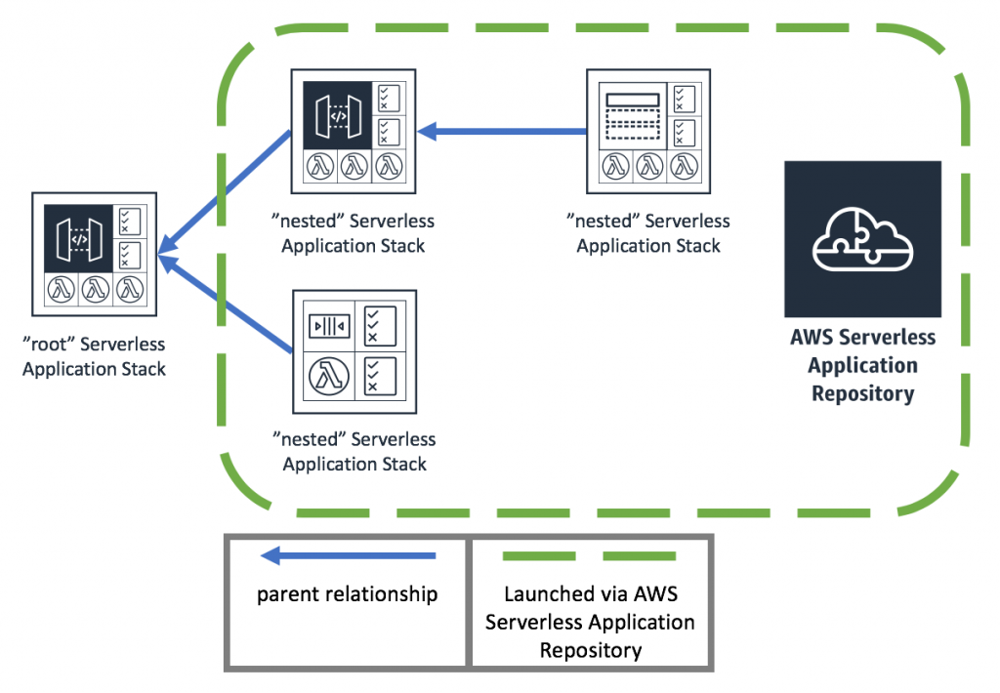

# AWS::Include Transform demo
Use the AWS::Include transform to insert boilerplate content into your templates. 

[Official AWS::Include Transform docuemnt](https://docs.amazonaws.cn/en_us/AWSCloudFormation/latest/UserGuide/create-reusable-transform-function-snippets-and-add-to-your-template-with-aws-include-transform.html)

For serverless application, with nested applications, serverless applications are deployed as stacks, or collections of resources, that contain one or more other serverless application stacks. You can reference resources created in these nested templates to either the parent stack or other nested stacks to manage these collections of resources more easily.

- [Simple AWS::Include demo](SimpleAWSIncludeDemo.md)
- [Nested Application for Lambda Authorizer](AddLambdaAuthorizer.md)

  helloworld:
    Type: AWS::Serverless::Application
    Properties:
      Location:
        ApplicationId: arn:aws-cn:serverlessrepo:cn-north-1:128255356669:applications/helloworld
        SemanticVersion: 
        
      