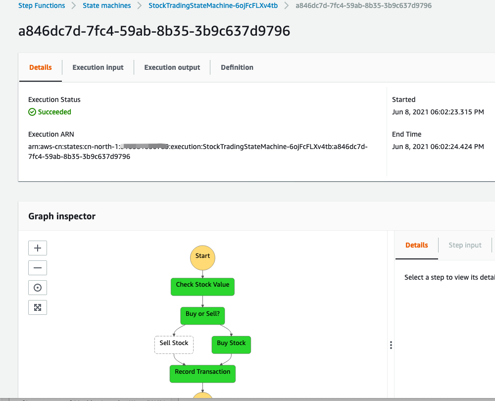

# Specify use the non-default environment

## Prepare
1. Start a Cloud9 in cn-northwest-1, we want to display cross region and cross account deployment
2. On Cloud9, [install the sam-cli](https://docs.aws.amazon.com/serverless-application-model/latest/developerguide/serverless-sam-cli-install-linux.html)

## Create the sample project and deploy it
1. Create the sample project

```bash
sam init --name hell-world-sam
Which template source would you like to use?
        1 - AWS Quick Start Templates
        2 - Custom Template Location
Choice: 1
What package type would you like to use?
        1 - Zip (artifact is a zip uploaded to S3)
        2 - Image (artifact is an image uploaded to an ECR image repository)
Package type: 1
Which runtime would you like to use?
        1 - nodejs14.x
        2 - python3.8
        3 - ruby2.7
        4 - go1.x
        5 - java11
        6 - dotnetcore3.1
        7 - nodejs12.x
        8 - nodejs10.x
        9 - python3.7
        10 - python3.6
        11 - python2.7
        12 - ruby2.5
        13 - java8.al2
        14 - java8
        15 - dotnetcore2.1
Runtime: 2

Cloning from https://github.com/aws/aws-sam-cli-app-templates

AWS quick start application templates:
        1 - Hello World Example
        2 - EventBridge Hello World
        3 - EventBridge App from scratch (100+ Event Schemas)
        4 - Step Functions Sample App (Stock Trader)
        5 - Elastic File System Sample App
Template selection: 4

    -----------------------
    Generating application:
    -----------------------
    Name: hell-world-sam
    Runtime: python3.8
    Dependency Manager: pip
    Application Template: step-functions-sample-app
    Output Directory: .

    Next steps can be found in the README file at ./hell-world-sam/README.md
```

2. Build your application to other account which credential specifed in the `second-cn` profile and plan deploy it to `cn-north-1` region

```bash
sam build --config-env dev --profile second-cn --region cn-north-1

Building codeuri: /home/ec2-user/workspace/hell-world-sam/functions/stock_checker runtime: python3.8 metadata: {} functions: ['StockCheckerFunction']
Running PythonPipBuilder:ResolveDependencies
Running PythonPipBuilder:CopySource
Building codeuri: /home/ec2-user/workspace/hell-world-sam/functions/stock_seller runtime: python3.8 metadata: {} functions: ['StockSellerFunction']
Running PythonPipBuilder:ResolveDependencies
Running PythonPipBuilder:CopySource
Building codeuri: /home/ec2-user/workspace/hell-world-sam/functions/stock_buyer runtime: python3.8 metadata: {} functions: ['StockBuyerFunction']
Running PythonPipBuilder:ResolveDependencies
Running PythonPipBuilder:CopySource

Build Succeeded

Built Artifacts  : .aws-sam/build
Built Template   : .aws-sam/build/template.yaml

Commands you can use next
=========================
[*] Invoke Function: sam local invoke
[*] Deploy: sam deploy --guided
```

3. Deploy your application
```bash
sam deploy --guided --config-env dev --profile second-cn --region cn-north-1

Configuring SAM deploy
======================

        Looking for config file [samconfig.toml] :  Not found

        Setting default arguments for 'sam deploy'
        =========================================
        Stack Name [sam-app]: step-functions-sample-app
        AWS Region [cn-north-1]: 
        #Shows you resources changes to be deployed and require a 'Y' to initiate deploy
        Confirm changes before deploy [y/N]: y
        #SAM needs permission to be able to create roles to connect to the resources in your template
        Allow SAM CLI IAM role creation [Y/n]: y
        Save arguments to configuration file [Y/n]: y
        SAM configuration file [samconfig.toml]: 
        SAM configuration environment [dev]: 

....

Initiating deployment
=====================
Uploading to step-functions-sample-app/7d746f0b5be2d09b4a527a3206b3e1c7.template  2903 / 2903  (100.00%)

Waiting for changeset to be created..

CloudFormation stack changeset
-----------------------------------------------------------------------------------------------------------------------------------------
Operation                          LogicalResourceId                  ResourceType                       Replacement                      
-----------------------------------------------------------------------------------------------------------------------------------------
+ Add                              StockBuyerFunctionRole             AWS::IAM::Role                     N/A                              
+ Add                              StockBuyerFunction                 AWS::Lambda::Function              N/A                              
+ Add                              StockCheckerFunctionRole           AWS::IAM::Role                     N/A                              
+ Add                              StockCheckerFunction               AWS::Lambda::Function              N/A                              
+ Add                              StockSellerFunctionRole            AWS::IAM::Role                     N/A                              
+ Add                              StockSellerFunction                AWS::Lambda::Function              N/A                              
+ Add                              StockTradingStateMachineHourlyTr   AWS::IAM::Role                     N/A                              
                                   adingScheduleRole                                                                                      
+ Add                              StockTradingStateMachineHourlyTr   AWS::Events::Rule                  N/A                              
                                   adingSchedule                                                                                          
+ Add                              StockTradingStateMachineRole       AWS::IAM::Role                     N/A                              
+ Add                              StockTradingStateMachine           AWS::StepFunctions::StateMachine   N/A                              
+ Add                              TransactionTable                   AWS::DynamoDB::Table               N/A                              
-----------------------------------------------------------------------------------------------------------------------------------------

Changeset created successfully. arn:aws-cn:cloudformation:cn-north-1:second-account:changeSet/samcli-deploy1623144268/1c3aecd7-ff9d-4395-aacf-af0b522ca397


Previewing CloudFormation changeset before deployment
======================================================
Deploy this changeset? [y/N]: y

....

CloudFormation outputs from deployed stack
-----------------------------------------------------------------------------------------------------------------------------------------
Outputs                                                                                                                                 
-----------------------------------------------------------------------------------------------------------------------------------------
Key                 StockTradingStateMachineArn                                                                          

Key                 StockTradingStateMachineRoleArn                                                                                    
-----------------------------------------------------------------------------------------------------------------------------------------

Successfully created/updated stack - step-functions-sample-app in cn-north-1
```

4. Testing
Run the step function `cn-north-1` region under `second-cn` account



5. Cleanup
```bash
aws cloudformation delete-stack --stack-name step-functions-sample-app --profile second-cn --region cn-north-1
```